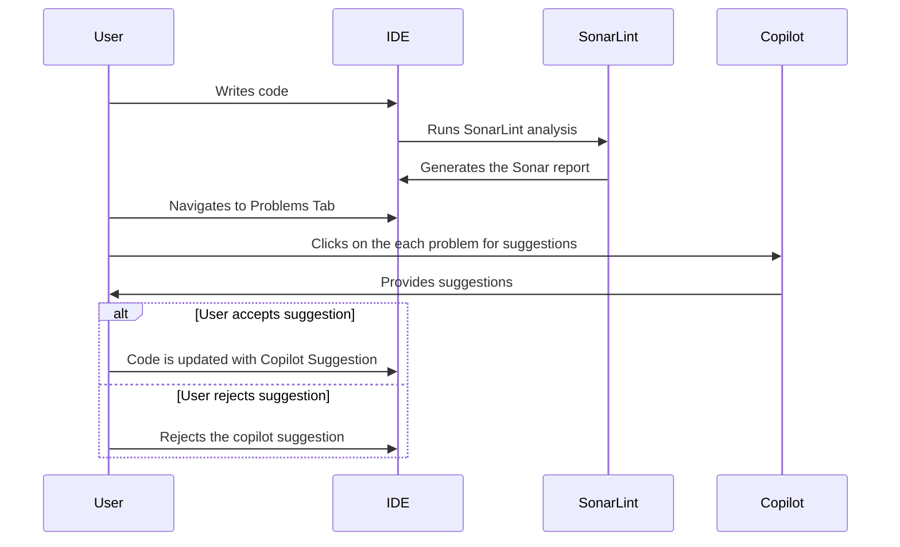

```mermaid
sequenceDiagram
 participant User as User
 participant IDE as IDE
 participant SonarLint as SonarLint

 User->>IDE: Writes code
 IDE->>SonarLint: Runs SonarLint analysis
 SonarLint->>IDE: Generates the Sonar report
 User->>IDE: Navigates to Problems Tab
 User->>Copilot: Clicks on the each problem for suggestions
 Copilot->>User: Provides suggestions
 alt User accepts suggestion
    User->>IDE: Code is updated with Copilot Suggestion
 else User rejects suggestion
    User->>IDE: Rejects the copilot suggestion
 end
```
